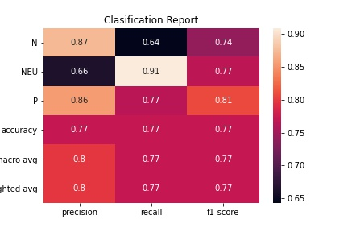
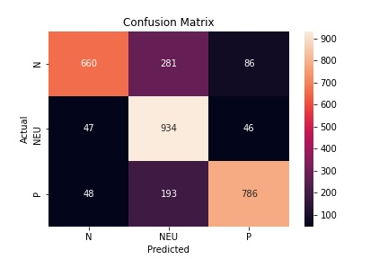

# Hate speech
En el siguiente trabajo se hará uso del análisis del lenguaje natural implementado con el  algoritmo supervisado de machine learning “Regresión Logística”, para crear un modelo que pueda predecir cuales tweets cuentan con un mensaje de odio.

## Dependencias
* Python3

## Ejecución
Una vez descargado el repositorio, se instalan las dependencias:

        pip install -r requirements.txt 
En caso de tener más de una versión de Python, entonces utilizar pip3, luego de haber instalado las dependencias ya será posible hacer la ejecución del archivo hate_speech.ipynb.

## Métricas de rendimiento 
El modelo ejecutado a través de Regresión logística nos muestra el siguiente reporte de clasificación :
 
 

  

   
acompañado de la siguiente matriz de confusión :

 
 
 
 

  

